<div align="center">
  
  <h1>followthrough.ai</h1>
  <p><strong>An agent-native note editor you never have to brief.</strong></p>
</div>

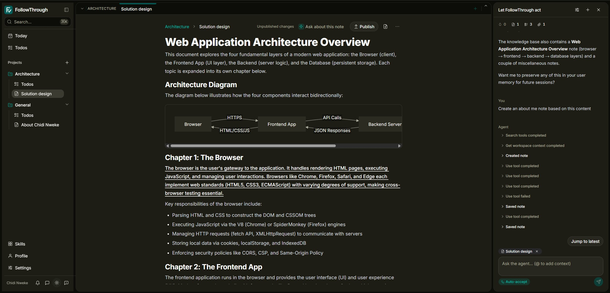

The usual way of working with AI is a tax: your notes live in one place, your tasks in another,
the project context lives in your head, and every new AI session starts with re-explaining all
of it. FollowThrough collapses that into one workspace. The editor is where you think; the
agent lives inside it and already carries the project — the decisions saved to memory, the
todos, the people you're waiting on. And the loop closes: the agent doesn't just talk about the
work, it does the work — extracting commitments from your notes, keeping the board honest,
producing artifacts — always proposing, never committing anything important silently.

> **Write notes → the agent extracts commitments and context → you triage on Today →
> the agent acts (with your approval) → work becomes artifacts and deliverables.**

## Why I built it

I was running Claude, Codex, and opencode in terminals inside VS Code, having them write markdown, then rendering that markdown somewhere else to actually read it. Every session started by re-explaining the same project. The context lived in my head, the notes lived in files, the tasks lived nowhere, and the agent knew none of it.

To be fair: a VS Code agent can grep your repo. The friction is everything around that. There is no durable context layer — no project memory that survives the session, no task management the agent can read and write, no clean export of the result to PDF or Word. You can assemble all of that yourself, per project, per machine — or you can work somewhere it already exists.

FollowThrough is the editor those agents should have been running inside.

## What it looks like

Real screens, both themes, in [`static/product-screenshots/`](static/product-screenshots/). The
feature-by-feature tour — what each screen is and why it matters — is in
[`product-walkthrough.md`](product-walkthrough.md).

**The centerpiece: the editor with AI inside it.** Select a passage and the AI toolbar is right
there — ask about it, extract its promises, find related notes, turn it into a diagram. Open
the agent panel and it reports what it already knows, offers to remember what matters, and then
acts: creating notes and updating boards with every tool call — successes and failures — on the
record.

|                                                                                                    |                                                                                                     |
| -------------------------------------------------------------------------------------------------- | --------------------------------------------------------------------------------------------------- |
| 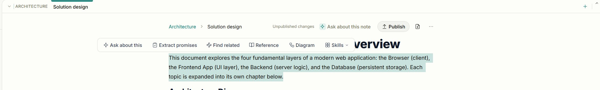      | 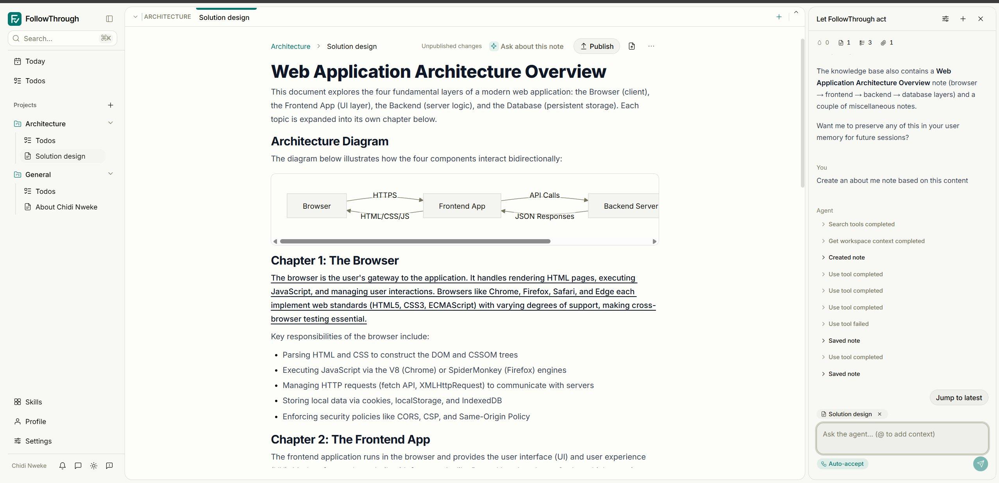        |
| **One selection away** — ask, extract promises, find related, reference, diagram.                  | **The agent in the editor** — it reads the workspace first, then acts, showing its work.            |
| 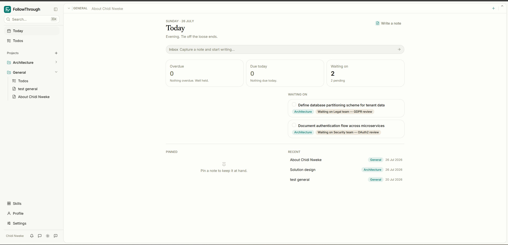                             | 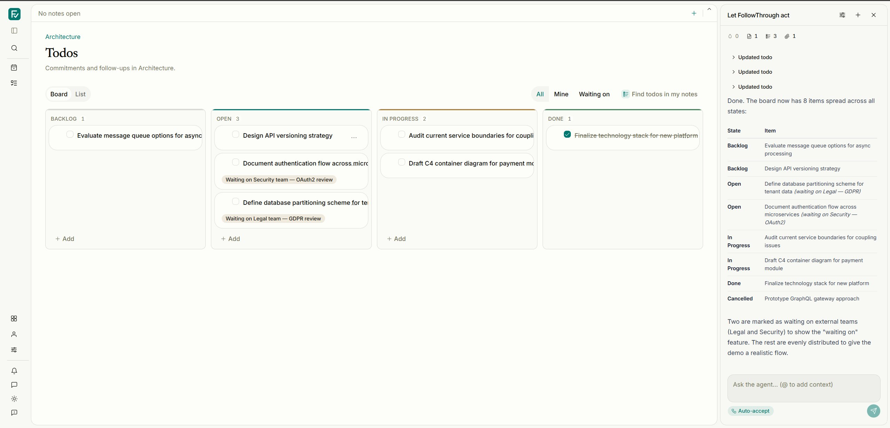                           |
| **Today** — overdue, due today, and who _you_ are waiting on.                                      | **The board** — the agent opens cards from notes and keeps them moving.                             |
| 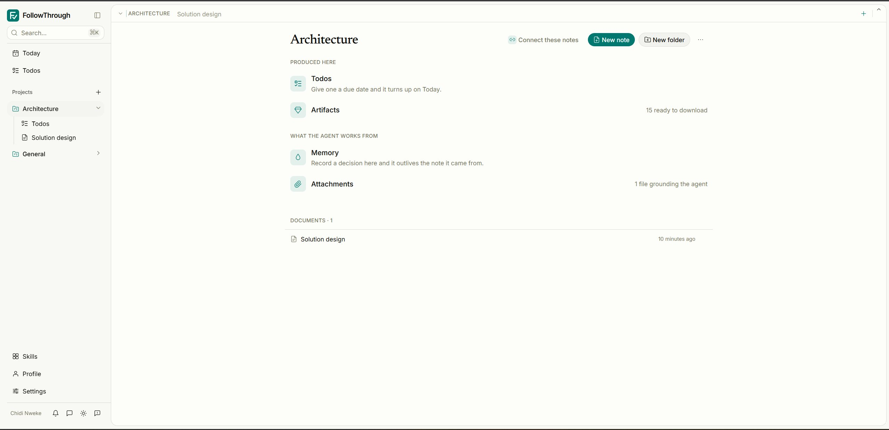                       | 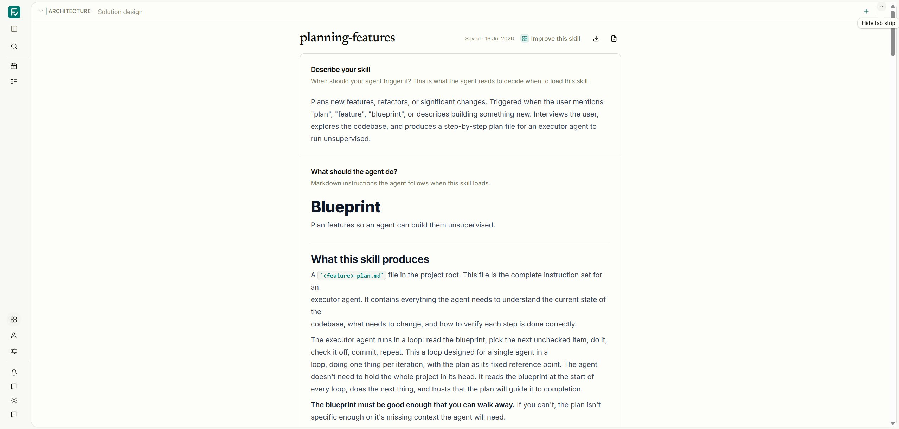                           |
| **The context layer** — what was produced here vs. what the agent works from: memory, attachments. | **Skills** — teach it your workflow once; it runs it on cue.                                        |
| 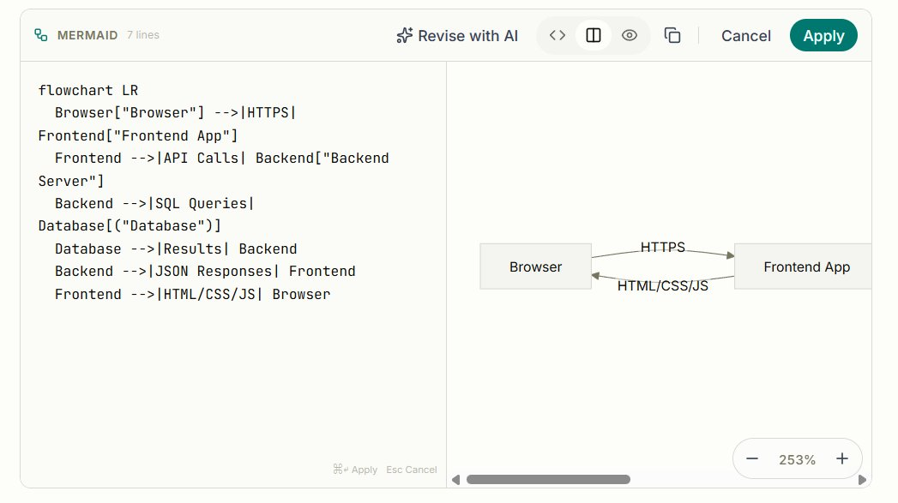                 | 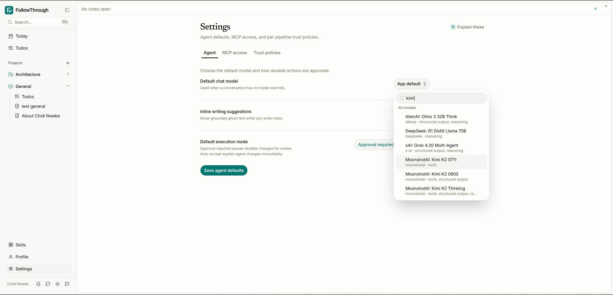 |
| **First-class diagrams** — Mermaid source, live render, Revise with AI.                            | **Your editor, your model, your choice** — any provider; approval or auto-accept per pipeline.      |
| 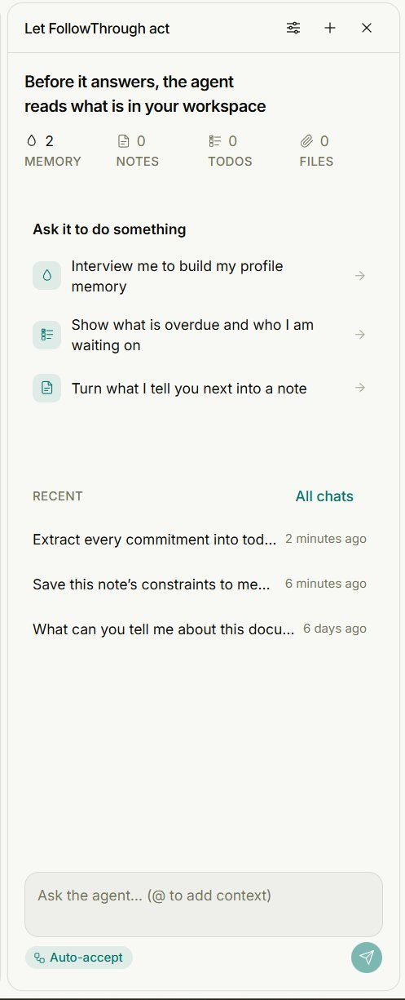                                 | 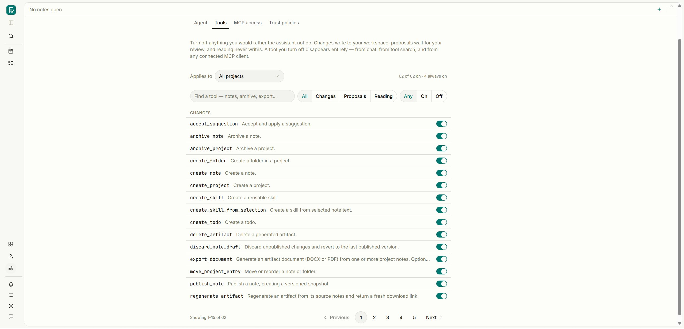          |
| **The agent panel** — it reads memory, notes, todos, and files before it answers.                  | **Anything you can do, it can do** — every capability a tool, every tool yours to turn off.         |

## The five moves

```text
Note            → Card
Selection       → Diagram
Selection       → Image
Project context → Draft
Draft           → Deliverable
```

Agents propose. The user accepts. Nothing important is committed silently, and everything
generated stays connected to the note it came from.

## Running it locally

**Prerequisites** — Node 22, pnpm, Docker (for Postgres), and an Infisical project holding the
application config.

```sh
pnpm install
cp .env.example .env          # Infisical bootstrap values only
pnpm db:start                 # Postgres with pgvector, via docker compose
pnpm dev
```

Configuration is loaded from Infisical before the SvelteKit server is imported, in both dev and
production. `.env` carries only the `INFISICAL_*` bootstrap values; database, object-storage, and
model settings live in the Infisical project, with `.env.infiscal.example` as the reference
template for those. `DATABASE_URL` and `OPENROUTER_API_KEY` are required; other values fall back to
the defaults in that template. Shell variables win over `.env`.

Auth is disabled in single-user dev mode, so `/` redirects straight to `/today`. Append `?landing`
to reach the public landing page while working on it.

**Schema changes.** The dev database is push-managed:

```sh
pnpm db:push        # dev — apply the schema directly
pnpm db:generate    # generate a migration for production
pnpm db:studio      # browse the data
```

`pnpm db:migrate` is not usable against the dev database — its journal is out of sync. After
`db:generate`, apply new columns to dev with `psql` (or `db:push`) rather than running the migrate
task locally.

**Checks and tests.**

```sh
pnpm check          # svelte-check
pnpm lint           # prettier + eslint
pnpm format         # prettier --write

pnpm test           # unit: client + server projects
pnpm test:repository  # contracts, against PGlite
pnpm test:evals       # model evals, reported to Phoenix
npx playwright test   # end-to-end
```

Vitest is split into four projects — `client`, `server`, `contracts`, and `evals` — so a change to
a repository can be checked against a real schema without booting the app.

## Architecture

| Where                           | What                                                                                                     |
| ------------------------------- | -------------------------------------------------------------------------------------------------------- |
| `src/routes/(app)/`             | Every authenticated page. Guarded in `src/hooks.server.ts` and again in `(app)/+layout.server.ts`.       |
| `src/routes/(marketing)/`       | The public landing page at `/`. The only unauthenticated route besides `/auth/*`.                        |
| `src/lib/remote/*.remote.ts`    | SvelteKit remote functions — the client-to-server surface.                                               |
| `src/lib/server/app-factory.ts` | `AppFactory` / `ControllerFactory`. Wiring lives here; routes ask the factory, never construct services. |
| `src/lib/server/db/schema.ts`   | The Drizzle schema — ~40 tables, notes through agent runs.                                               |
| `src/lib/services/retrieval/`   | Indexing, semantic search, and reranking over `search_chunks` (`halfvec(3072)`, pgvector).               |
| `src/lib/components/edra/`      | The vendored TipTap 3 editor.                                                                            |
| `src/lib/components/ui/`        | shadcn-svelte primitives. Custom icons in `src/lib/components/icons/`.                                   |

UI conventions — tokens, type scale, the interaction contract — are in
[`DESIGN_SYSTEM.md`](DESIGN_SYSTEM.md). Read it before adding a component.

## Observability

Agent runs are instrumented with OpenTelemetry and exported to Arize Phoenix, so every model call,
tool call, and retrieval is inspectable after the fact.


Collector config is in `otel-collector-config.yaml`; the Node instrumentation bootstrap is
`scripts/otel-instrumentation.js`, loaded via `--import` in `pnpm start`.

## Deployment

Komodo supplies only the `INFISICAL_*` bootstrap variables plus the direct `OTEL_*` and `PHOENIX_*`
telemetry variables.

Before the first deployment, and before every release containing Drizzle migrations, run the
one-shot setup profile:

```sh
docker compose -f docker-compose.prod.yml --profile setup run --rm migrate
```

It provisions or rotates the database role, stores `DATABASE_URL` in the application Infisical
project, and runs committed migrations before exiting. Deploy or restart `app` once it succeeds.

## Why it exists

The long version — the workflow this replaces, what each concept is for, and how agents are
expected to behave — is in [`docs/VISION.md`](docs/VISION.md).

The short version:

> **Think in notes. Track what matters. Preserve the context. Finish the work.**
