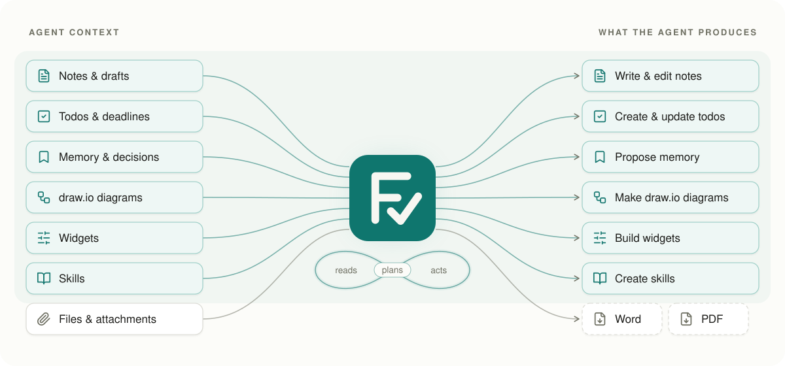
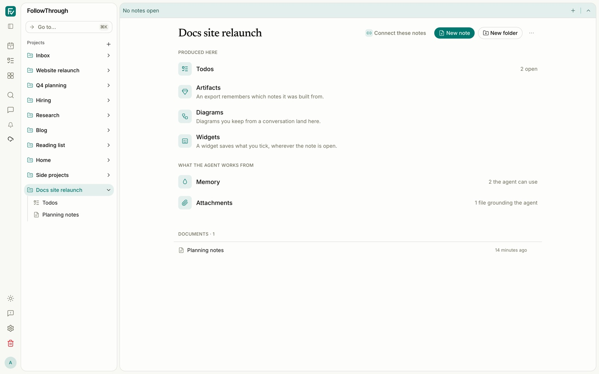
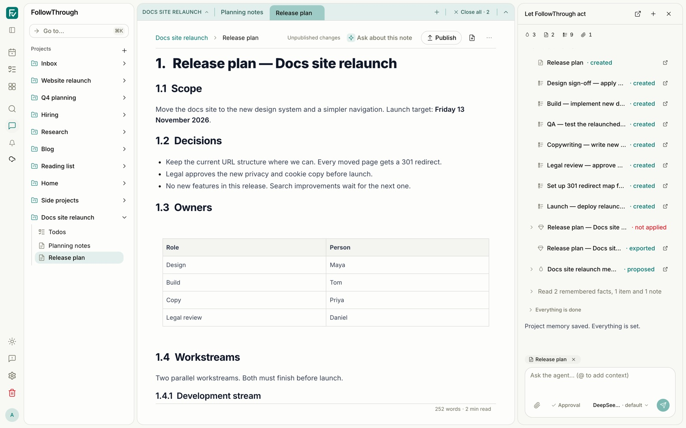
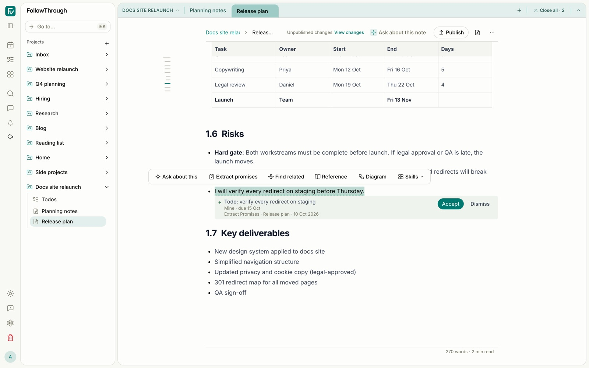
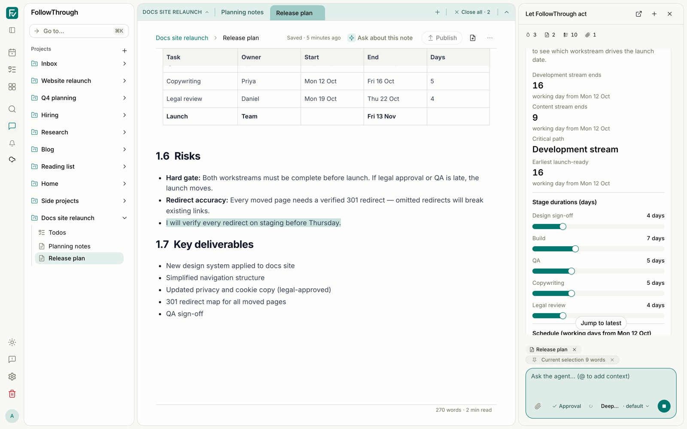
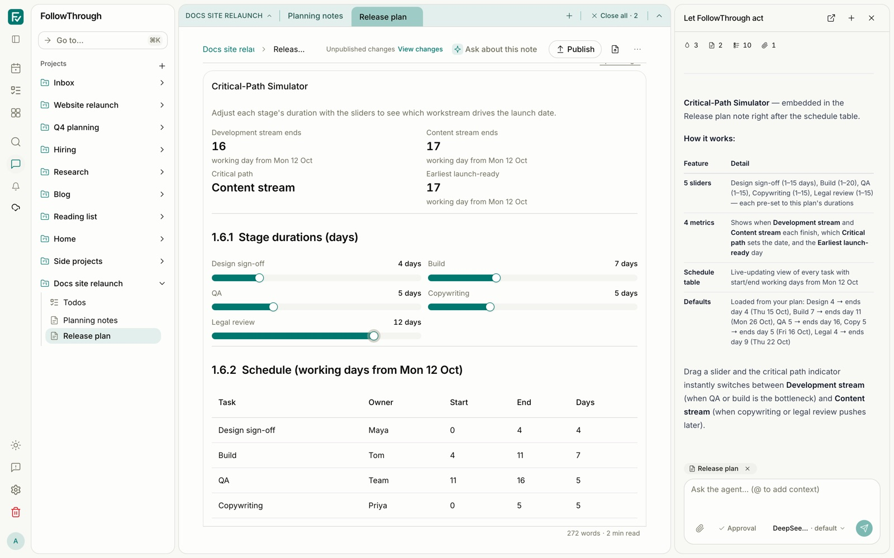

<div align="center">
  
  <h1>FollowThrough</h1>
  <p><strong>The agent doesn't just know your project. It can work on it.</strong></p>
</div>

FollowThrough keeps your notes, todos, decisions, files and project memory in one workspace. The
agent reads that context and acts on it: it writes notes, updates the board, builds diagrams and
widgets, and exports documents. What you keep becomes context for the next task.

<p align="center">
  <picture>
    <source media="(prefers-color-scheme: dark)" srcset="static/readme/hero-dark.svg" />
    
  </picture>
</p>

## See it in action

One project, start to finish. Every screen below is the real app, working on the same data.

### 1. Start with what you already have

<picture>
  <source media="(prefers-color-scheme: dark)" srcset="static/readme/walkthrough/01-context-dark.jpg" />
  
</picture>

A new project holds a planning note, the launch brief as a PDF, two decisions in memory, and the
first todos. They belong to the project, not to one conversation.

### 2. Ask for work, not answers

> Read the launch brief and these planning notes. Write a release plan note, add the outstanding
> launch tasks to the board, and export the release plan as a Word brief for the team.

<picture>
  <source media="(prefers-color-scheme: dark)" srcset="static/readme/walkthrough/02-agent-acts-dark.jpg" />
  
</picture>

From one request, the agent wrote the release plan, added seven todos with owners and dates, and
exported a Word brief. Every action is listed, including the one that failed before it retried.

### 3. Keep working yourself

<picture>
  <source media="(prefers-color-scheme: dark)" srcset="static/readme/walkthrough/03-extract-promise-dark.jpg" />
  
</picture>

It is your note too. Here QA went from 3 to 5 days by hand, and a new line made a promise.
Highlight it and choose **Extract promises**: the todo is proposed in place, with its due date
worked out, and it stays linked to the sentence it came from.

### 4. Build on what changed

> Build an interactive critical-path simulator for this launch plan. Use the stages and durations
> in this note. Let me change each stage with a slider and show which workstream sets the launch
> date. Embed it in this note.

<picture>
  <source media="(prefers-color-scheme: dark)" srcset="static/readme/walkthrough/04-widget-proposal-dark.jpg" />
  
</picture>

The agent used the edited plan: QA is 5 days, so development takes 16 days and sets the date. The
widget is a proposal. Nothing goes into the note until you approve it.

### 5. The work stays

<picture>
  <source media="(prefers-color-scheme: dark)" srcset="static/readme/walkthrough/05-widget-result-dark.jpg" />
  
</picture>

The simulator now lives in the note. Drag Legal review to 12 days and content becomes the critical
path. The plan, the todos, the widget and the Word brief are all part of the project, so the next
conversation starts with them.

## Controlled by you

- **Approve or auto-accept.** Each chat runs in approval mode or auto-accept. Changes that matter,
  such as new notes, widgets and memory, wait for you in approval mode.
- **Every capability is a tool, and every tool can be turned off.** The agent can do what you can
  do in the app, and nothing you have switched off.
- **Any model.** Pick the model per chat through OpenRouter.

The [trust model](https://chidirnweke.github.io/FollowThrough.ai/explanation/agents-propose-users-accept/)
explains what the agent may do on its own and what always waits for you.

## Why I built it

I was running Claude, Codex, and opencode in terminals inside VS Code, having them write markdown, then rendering that markdown somewhere else to actually read it. Every session started by re-explaining the same project. The context lived in my head, the notes lived in files, the tasks lived nowhere, and the agent knew none of it.

To be fair: a VS Code agent can grep your repo. The friction is everything around that. There is no durable context layer — no project memory that survives the session, no task management the agent can read and write, no clean export of the result to PDF or Word. You can assemble all of that yourself, per project, per machine — or you can work somewhere it already exists.

FollowThrough is the editor those agents should have been running inside.

## Documentation

The published documentation — usage guides, architecture decisions, the API reference, and the
release history — lives at <https://chidirnweke.github.io/FollowThrough.ai/>. The
[contributing guide](https://chidirnweke.github.io/FollowThrough.ai/contribute/) explains how
changes and releases land. Docs source is in [`docs/`](docs/).

## Running it locally

**Prerequisites** — Node 22, pnpm, Docker (for Postgres), and an Infisical project holding the
application config.

```sh
pnpm install
cp .env.example .env          # Infisical bootstrap values only
pnpm db:start                 # Postgres with pgvector, via docker compose
pnpm dev
```

Configuration is loaded from Infisical before the SvelteKit server is imported, in both dev and
production. `.env` carries only the `INFISICAL_*` bootstrap values; database, object-storage, and
model settings live in the Infisical project, with `.env.infiscal.example` as the reference
template for those. `DATABASE_URL`, `OPENROUTER_API_KEY`, `MISTRAL_API_KEY`, and all four
`AUTHENTIK_*` settings are required; other values fall back to the defaults in that template. Shell variables win over `.env`.

`MISTRAL_API_KEY` powers attachment OCR through Mistral Document AI, which reads PDFs, office
documents, ebooks and images. Note that OCR fetches each attachment from a presigned object-storage
URL, so the bucket must be reachable from Mistral — a bucket bound to `localhost` will not work.

Authentication is required in development and production. Missing Authentik configuration fails
startup; there is no anonymous single-user mode. Signed-in, approved users visiting `/` redirect
to `/today`. Append `?landing` to reach the public landing page while signed in.
Browser tests mint database-backed sessions without contacting Authentik. Their managed server
uses dummy provider settings; `E2E_USER_ID` selects the test account.

**Schema changes.** The dev database is push-managed:

```sh
pnpm db:push        # dev — apply the schema directly
pnpm db:sync:setup  # dev — install sync SQL functions/triggers and seed missing inventory
pnpm db:generate    # generate a migration for production
pnpm db:studio      # browse the data
```

`pnpm db:migrate` is not usable against the dev database — its journal is out of sync. After
`db:generate`, apply new columns to dev with `psql` (or `db:push`) rather than running the migrate
task locally.

**Workspace synchronization.**

Run `pnpm db:sync:setup` after `pnpm db:push`, with `DATABASE_URL` set to the same development
database. Schema push does not install PostgreSQL functions or triggers. The setup command
uses the checked-in synchronization SQL, installs the triggers, and seeds only missing
inventory entries. Repeating it preserves existing versions, deletion evidence, and cursors.
It does not modify the migration journal. Production continues to use the full migrations.

The workspace is rendered in the browser (`ssr = false`). Authenticated `curl` requests can
check redirects and cookies, but cannot verify workspace content. Use Playwright with
`tests/.auth/state.json` and wait for the workspace download before inspecting the UI.

**Checks and tests.**

```sh
pnpm check          # svelte-check
pnpm lint           # prettier + eslint
pnpm format         # prettier --write

pnpm test           # unit: client + server projects
pnpm test:repository  # contracts, against one shared PostgreSQL Testcontainer
pnpm test:evals       # model evals, reported to Phoenix
npx playwright test   # end-to-end
```

Vitest is split into focused Node, browser, contract, and evaluation projects, so a change to
a repository can be checked against a real schema without booting the app.

## Architecture

| Where                                       | What                                                                                                                     |
| ------------------------------------------- | ------------------------------------------------------------------------------------------------------------------------ |
| `src/routes/(app)/`                         | Authenticated browser pages. `(app)/+layout.ts` starts the workspace; remote functions authenticate each server request. |
| `src/routes/(marketing)/`                   | The public landing page at `/`. The only unauthenticated route besides `/auth/*`.                                        |
| `src/lib/remote/<capability>/`              | SvelteKit remote functions — the client-to-server surface.                                                               |
| `src/lib/server/application.ts`             | Dependency-ordered capability-factory composition and the production controller facade.                                  |
| `src/lib/server/db/schema/`                 | Capability-owned Drizzle schemas; `index.ts` is the registry for ~40 tables.                                             |
| `tests/integration/<capability>/`           | Non-parallel repository contracts sharing the PostgreSQL database harness.                                               |
| `src/lib/server/services/knowledge-search/` | Indexing, semantic search, and reranking over `search_chunks` (`halfvec(3072)`, pgvector).                               |
| `src/lib/components/edra/`                  | The vendored TipTap 3 editor.                                                                                            |
| `src/lib/components/ui/`                    | shadcn-svelte primitives. Custom icons in `src/lib/components/icons/`.                                                   |

UI conventions — tokens, type scale, the interaction contract — are in
[`docs/design/design-system.md`](docs/design/design-system.md). Read it before adding a component.

## Repository documentation

- [Architecture rules](docs/architecture/README.md) and [type narrowing](docs/architecture/type-narrowing.md)
- [Design system](docs/design/design-system.md) and its [derived agent digest](docs/design/agent-digest.md)
- [Implementation plans](docs/plans/)
- [Contribution and PR evidence rules](AGENTS.md)
- [Published documentation source](docs/src/content/docs/)

## Observability

Agent runs are instrumented with OpenTelemetry and exported to Arize Phoenix, so every model call,
tool call, and retrieval is inspectable after the fact.

Collector config is in `otel-collector-config.yaml`; the Node instrumentation bootstrap is
`scripts/otel-instrumentation.js`, loaded via `--import` in `pnpm start`.

## Deployment

Komodo supplies only the `INFISICAL_*` bootstrap variables plus the direct `OTEL_*` and `PHOENIX_*`
telemetry variables.

Before the first deployment, and before every release containing Drizzle migrations, run the
one-shot setup profile:

```sh
docker compose -f docker-compose.prod.yml --profile setup run --rm migrate
```

It provisions or rotates the database role, stores `DATABASE_URL` in the application Infisical
project, and runs committed migrations before exiting. Deploy or restart `app` once it succeeds.

## Why it exists

The long version — the workflow this replaces, what each concept is for, and how agents are
expected to behave — is in [`docs/VISION.md`](docs/VISION.md).

The short version:

> **Think in notes. Track what matters. Preserve the context. Finish the work.**
