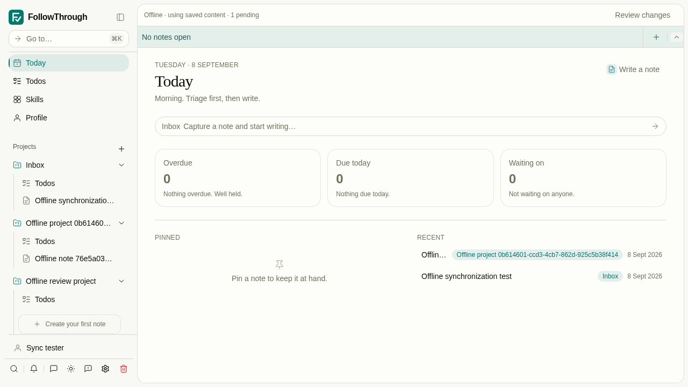
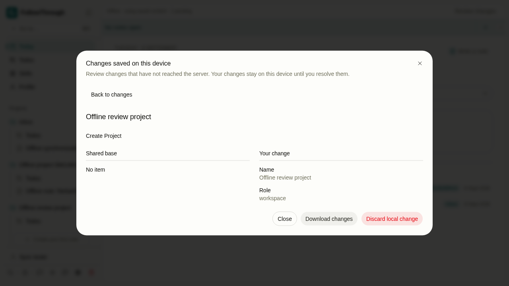
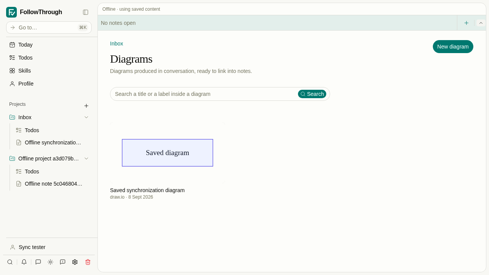
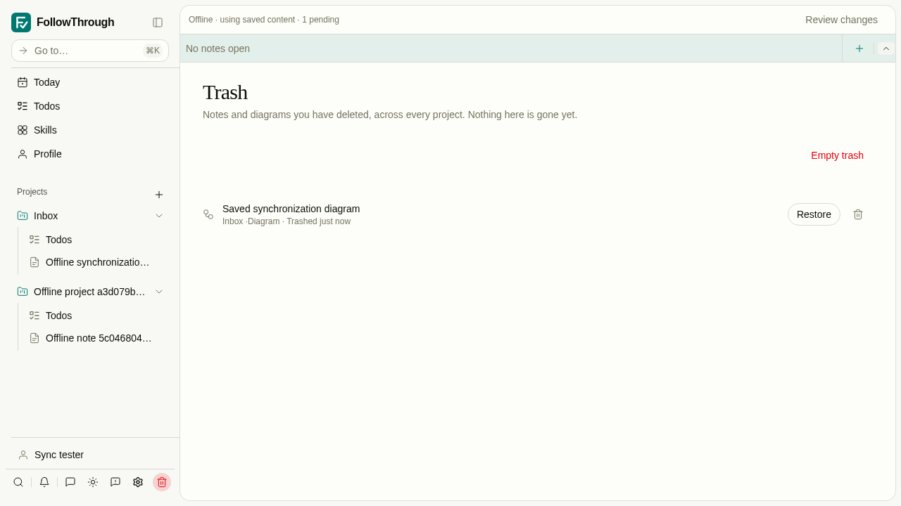

# Offline write review

These are starting-state and result captures of the new review flow, at 1280 × 720 in the light theme.
They are not before/after captures of the old implementation.

Setup: `pnpm test:sync:pwa` creates an isolated temporary PostgreSQL container, runs all migrations,
and seeds a synthetic account, inbox, note, and saved conversation. Playwright mints a session for
that account. The scenario creates a project while offline, returns to Today, and opens its pending
change for review. No model calls or private user data are involved. The container is removed when
the test command exits normally.

Starting state: the project is saved on the device and the shared status offers **Review changes**.

Result: the review shows the retained local project and its absent server base. The user can download
its full record or explicitly discard it. The same test verifies that discard removes the pending write.

## Offline diagram trash actions

The same isolated fixture now includes a saved draw.io document and its rendered SVG. These captures show the new offline action flow at the same viewport and theme. No external editor or model call is needed.

Starting state: the shared cache supplies the saved diagram and its preview offline.

Result: the confirmation waits for device persistence before closing. Trash shows the retained diagram and the shared pending-write status. The test also restores, archives, and deletes it through offline reloads.
