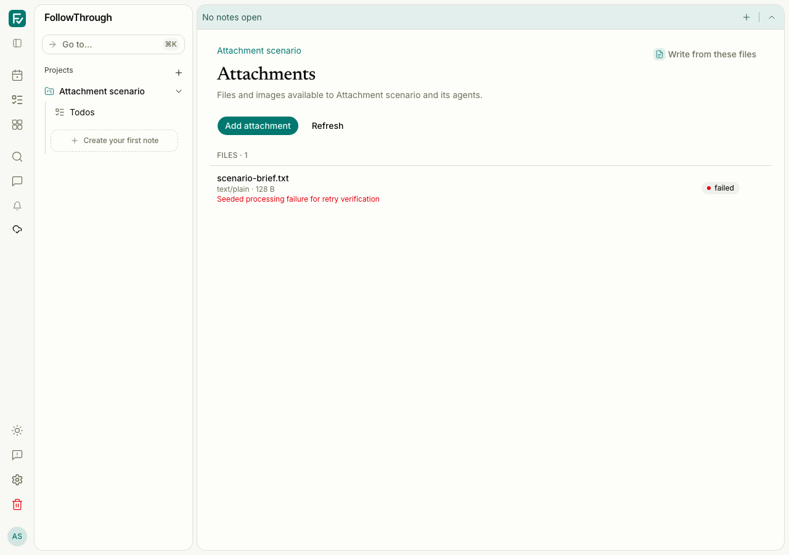
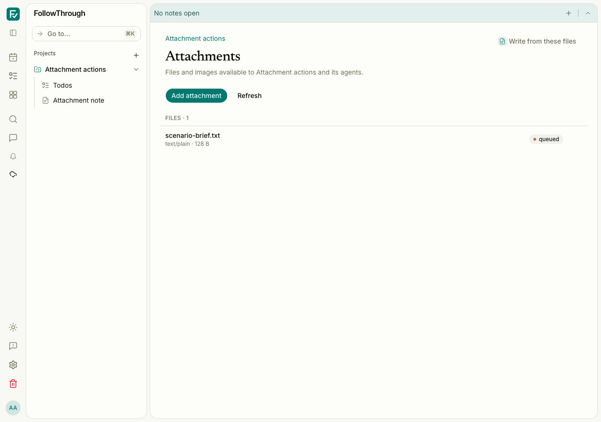
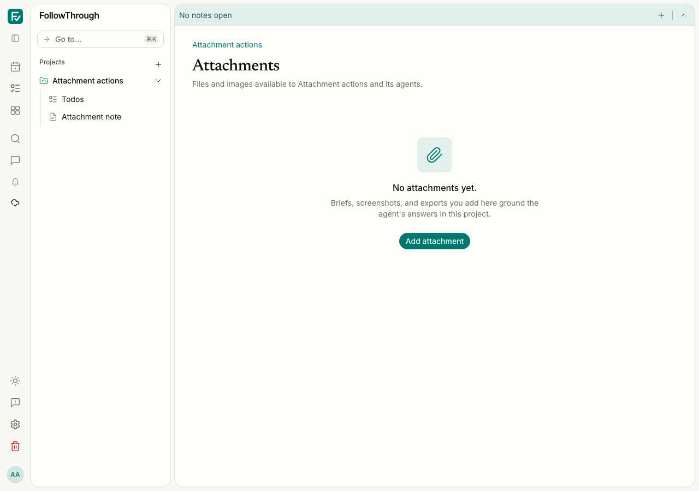
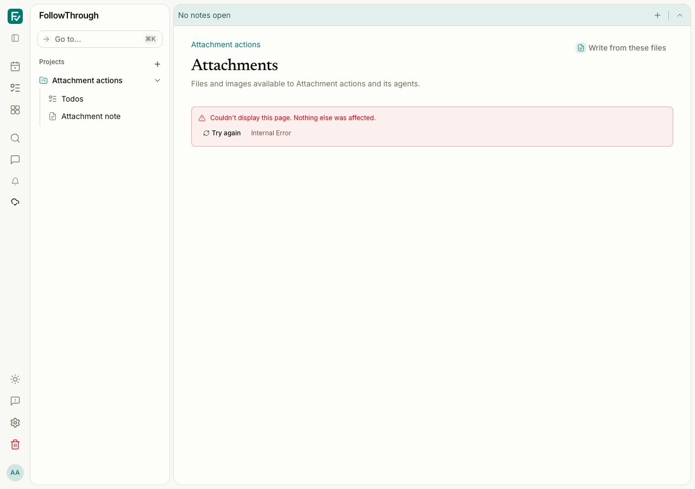
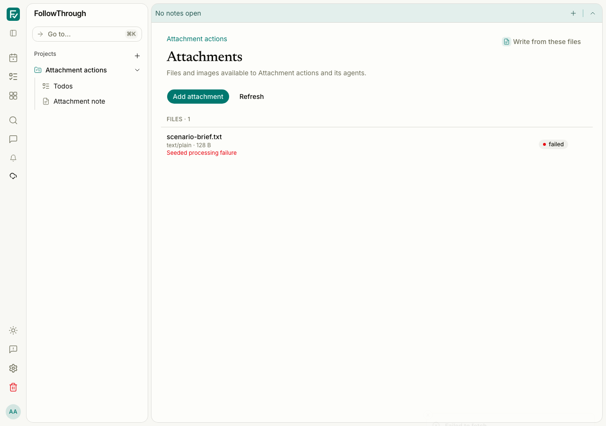

# Browser attachment independence

Baseline: #357 at `b5f22d9abca1476db5a0a615115809c2dba822ed`.
Captures use Chromium, a 1280 × 900 viewport, light theme, and synthetic local data.
The baseline ran in a separate linked worktree. No private content or session tokens
are included here.

## Reproduction

Run `tests/e2e/attachment-actions.e2e.ts` with the authenticated Playwright setup.
Its fixture creates a local account/session, project, note, and a 128-byte text
attachment with a failed processing version. Each case removes its own data.
Open the project's Attachments page, retry processing and reload, or remove the
attachment and reload. For the failure case, abort the reservation request and
select `rejected.txt` with the file picker.

The list pair uses the same stored synthetic project. The action pairs use fresh
accounts with the same content and labels. The local database initially lacked
`attachment_object_removals`; applying that table's existing migration definition
made the baseline removal case pass. No schema source changed in this slice.

## Matched captures

Before — the project lists the seeded failed attachment.

After — the independent attachment controller preserves the same list.

Before — retry changes the processing status to queued and survives reload.

After — retry still persists and the independent metadata pull updates the list.

Before — removal survives reload after the local schema prerequisite is present.

After — removal still produces the empty state after reload.

Before — selecting a file and resetting the picker triggers the inherited
`InvalidStateError` in the file input's value binding. The page shows its error boundary.

After — the file input uses its files binding without writing a nonempty value.
The reservation failure leaves the list and add control usable. The E2E test
checks the failure message, enabled picker, and absence of the rejected attachment;
the screenshot captures the toast during its entrance animation.

## Coverage limits

All three final authenticated journeys pass. They exercise real remote retry/removal,
database state, browser cache synchronization, and rendering. Reservation failure uses
a Playwright transport abort. These are seeded UI checks, not live object-storage or
model-processing journeys. No bytes or model calls are needed for these scenarios.

Typed fakes cover reservation → transfer → completion ordering, failures and retries,
signed downloads, protected removal, concurrent uploads and cache pulls, atomic cache
failure, inline images, screenshots, and account/session/editor replacement races.
Successful real object-storage transfer and live processing were not run.
