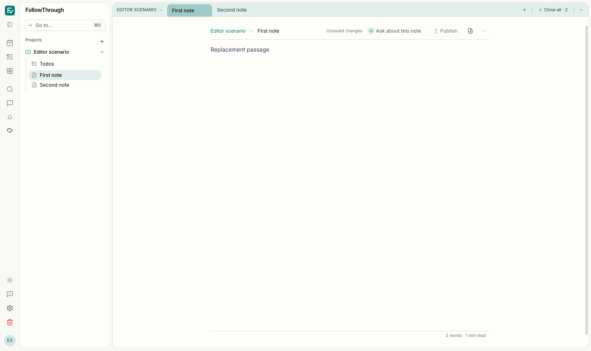
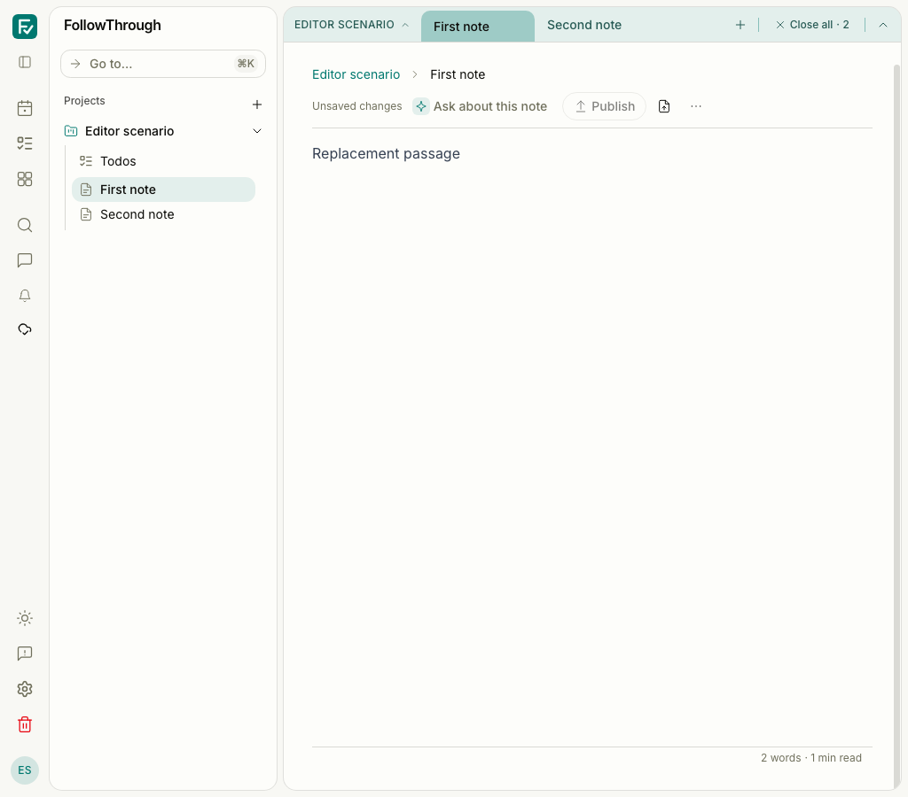

# Editor and clipboard independence evidence

Before captures use #351 at `15ed7610db3c2cddb47c798757bd0f5ff9eaca03`. After captures
use the independent editor and clipboard controllers. Both show the real authenticated app,
light mode, the same synthetic passage, sibling tabs, and a completed raw paste. The viewports
are 1680 × 1000 and 1024 × 900. The layout is unchanged; these captures verify the retained
interaction state, not the asynchronous cancellation tests.


Before — the selected passage has become “Replacement passage”; both note tabs remain visible.



After — the clipboard controller preserves the pasted passage and both note tabs.


Before — the narrow header wraps above the pasted passage.



After — the narrow layout retains the passage, note controls, and sibling tabs.

## Reproduction

Use a local development/test PostgreSQL database and the authenticated Playwright setup.
Each test creates a synthetic account, project, session, and notes, then deletes only that
account and its records. No live model calls or external object storage are needed. The media
scenario stores a browser-generated PNG and Mermaid source in its synthetic note.

```sh
pnpm test:e2e tests/e2e/note-editor-operations.e2e.ts tests/e2e/note-workspace.e2e.ts
```

The observed runs used an ignored Playwright configuration on port 5191, one worker, and dummy
model credentials. Clipboard runs had exclusive browser focus. The capture variant waited for
the context menu to close after paste, captured both viewports, then restored editor focus before
undo. An initial capture-only run omitted that focus restoration and failed at undo; the corrected
baseline capture and after capture both passed. The unchanged five baseline journeys also passed.

Six tracked after journeys passed: menu copy/paste with undo/redo, durable autosave, reload and
chat/tab handoff; native image-and-diagram copy/cut with undo; publication/discard/history;
offline save/publication; and both conflict choices. The extra capture variant passed as well.
The native media case reads the system clipboard HTML and verifies two embedded PNGs before
cutting and undoing. Autosave cases verify committed database content, not a fixed delay.

Browser controller tests separately cover late paste after release, destruction, replacement,
and remounting; split panes; cut after intervening edits or selection movement; change-then-undo;
initialization history; incomplete media; and clipboard activation expiring during rendering.
A workspace controller test verifies cancellation when historical restore replaces the document.

Development-server output includes the inherited `/offline-shell.html` 404. Browser tests also
retain the existing Svelte `derived_inert` warning. These runs do not verify production PWA
installation or live AI flows.
