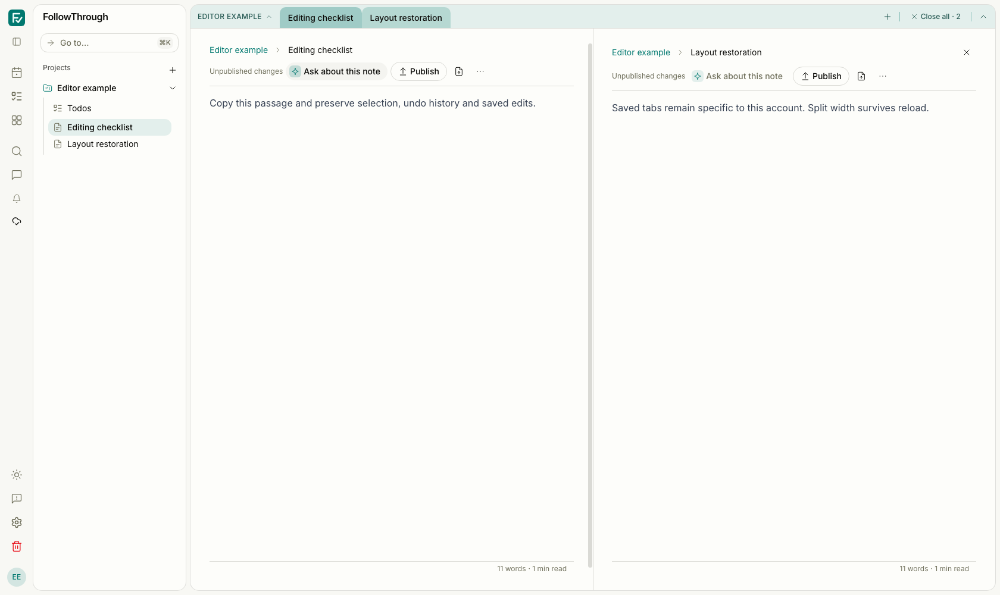
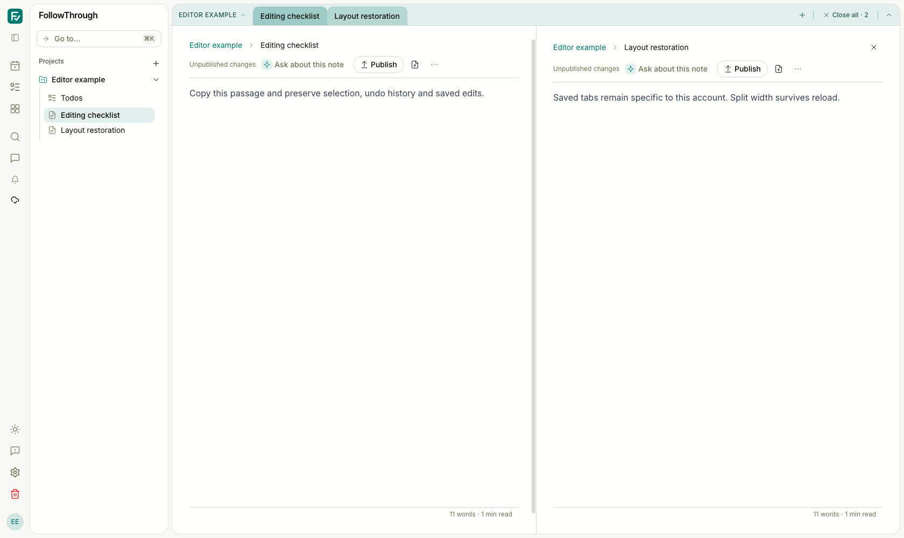
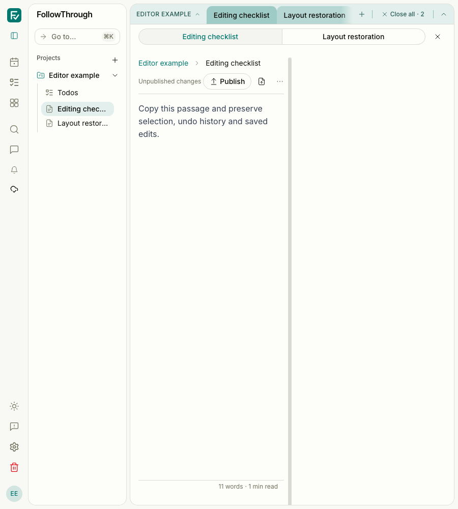

# Browser editor operation evidence

The before captures show #347 at `4bbca131`. The after captures show this contribution.
Both use the same synthetic local account and two notes, light theme, reduced motion,
and split URL. No model calls were made. The editor layout remains unchanged.

## Reproduction

Use an isolated authenticated development server and browser context. These captures used
port 5197, a temporary `USER` account, an inbox project named “Editor example”, and two notes:

- “Editing checklist”: “Copy this passage and preserve selection, undo history and saved edits.”
- “Layout restoration”: “Saved tabs remain specific to this account. Split width survives reload.”

Open `/notes/<first>?tabs=<first>,<second>&split=<second>`. Select the first paragraph,
open its context menu and copy as Markdown. Verify the clipboard text. Select it again,
put “Replacement passage” on the clipboard, and choose Paste raw. Undo, redo, then undo.
Ask about the note and verify that the chat composer is populated without starting a run.
Return to the split URL. Wait for both editors and fonts, blur focus, and move the pointer
away. Capture at 1680×1000 and 900×1000 with the same data. Remove only the synthetic
account and its dependent records after verification.

The durable `tests/e2e/note-editor-operations.e2e.ts` scenario creates and removes its own
local synthetic account. It verifies remembered selection, clipboard contents, undo/redo,
autosave through a database read, sibling-tab navigation, reload and note-to-chat handoff.
Run it with the authenticated Playwright setup and an isolated server. Do not run another
browser suite during native clipboard checks: those operations require browser focus.

The isolated production-preview scenarios select “retains an offline note edit” and the
account restoration test from `pnpm test:sync:pwa`. The attachment insertion browser test
uses a valid PNG and a typed upload callback returning the stable attachment content URL.
It verifies the editor insertion path; it does not exercise object storage or a live upload.

## Captures

Before — at 1680 px, the selected note and its sibling remain visible after the clipboard flow.

After — at 1680 px, controller-owned operations preserve the same note content and split layout.

Before — at 900 px, the pane switcher retains both notes and shows the selected note.

After — at 900 px, the selected note and pane identities remain unchanged.
