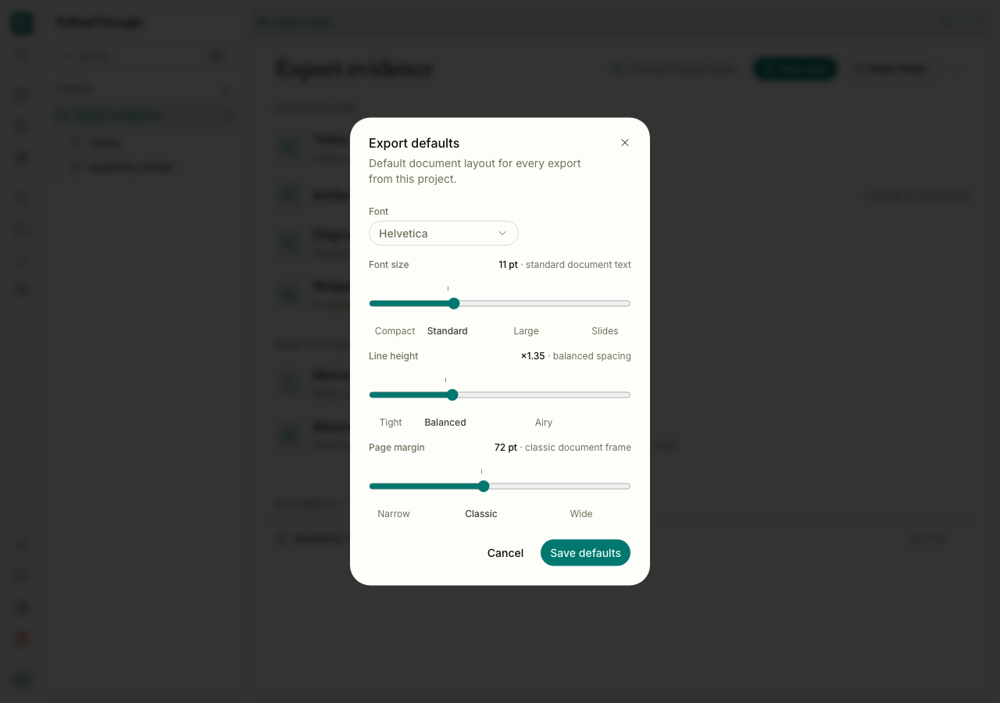
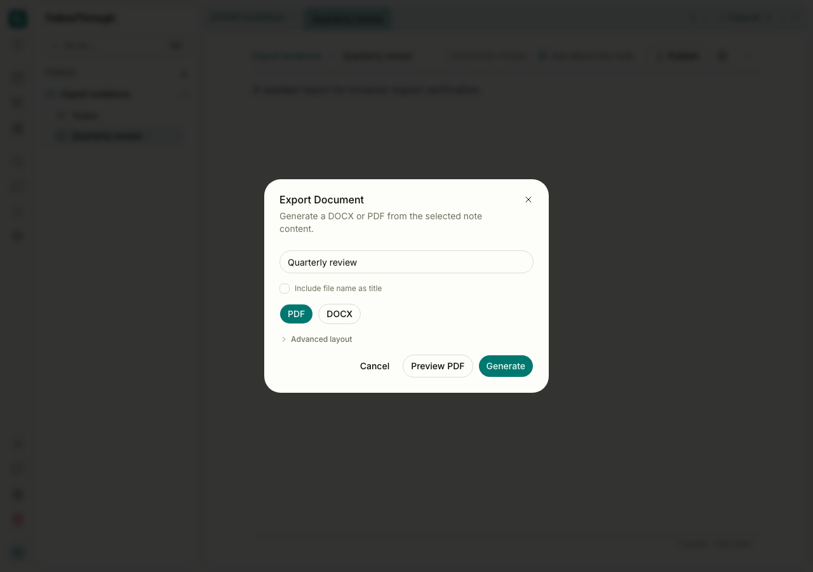

# Browser export and artifact independence

The before captures use #365 at `c05bcef0651d915981f4eb098d2f49f1d0329e8a`.
The after captures use this change. Both use Chromium at 1280 × 900, light theme,
a local authenticated session, and equivalent synthetic project/note data.
The export defaults and closed-preview states use the same controls and interaction sequence.



Before — project export defaults are available in the settings dialog.


After — the same settings controls remain available. Saving offline persists the draft
through dialog close, reconnect and reload.



Before — closing the nested PDF preview returns to the export dialog. Instrumented
URL creation/release counters show one PDF URL created and zero released at this point.


After — closing the nested preview returns to the same export dialog. Counters show
one PDF URL created and one released. The screenshots establish the matched UI state;
the URL counts come from browser instrumentation, not image interpretation.

## Reproduction

Start the local database and object storage with the repository's development configuration.
Start the authenticated test server with `pnpm dev:e2e`, then run:

```sh
pnpm exec playwright test tests/e2e/deliverable-actions.e2e.ts --project=app
```

The test creates a unique local user, session, project, two notes and a seeded artifact.
It deletes only that user's records and object-storage prefixes afterward. It refuses
nonlocal database and object-storage targets. No live model calls are made.

For the captures, open the seeded project's export defaults, save Courier, open the
Quarterly review note's export dialog, request a PDF preview, and close the nested
preview with Escape. Capture the settings dialog and the returned export dialog.
Observe PDF Blob URLs by wrapping `URL.createObjectURL` and `URL.revokeObjectURL`
before loading the page. The committed E2E case repeats the URL check after a failed
preview request and a successful retry.

All eight final seeded journeys pass: offline settings persistence, preview failure
and retry with URL cleanup, explicit regeneration failure, persisted removal, real
PDF and DOCX generation/download/regeneration, and real ZIP and merged DOCX bundles.
The six persistence and successful-generation journeys also pass on the exact base.
PDF downloads and the preview Blob have the PDF signature. DOCX and ZIP contents
contain the seeded notes. Headless Chromium does not paint the embedded PDF viewer;
these captures do not establish visual PDF page layout.

Typed controller tests cover concurrent requests, failed reads and writes, retries,
account/session/project replacement, stale results, URL replacement, ordered document
reads, bundle paths, diagram themes, rasterization fallback and atomic synchronization.
Server generation and processing code is unchanged.
