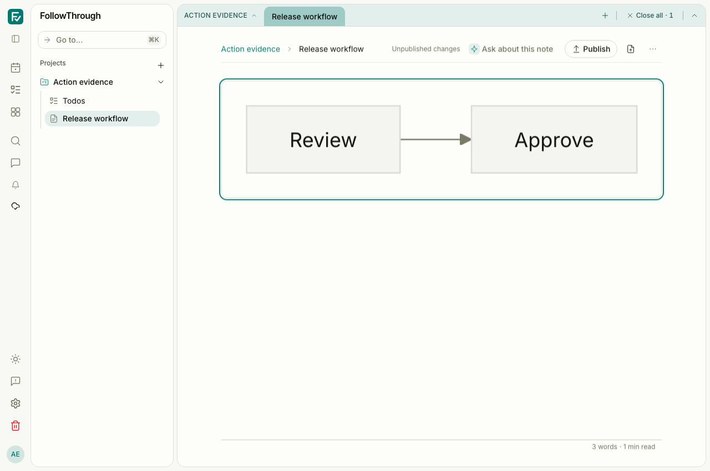
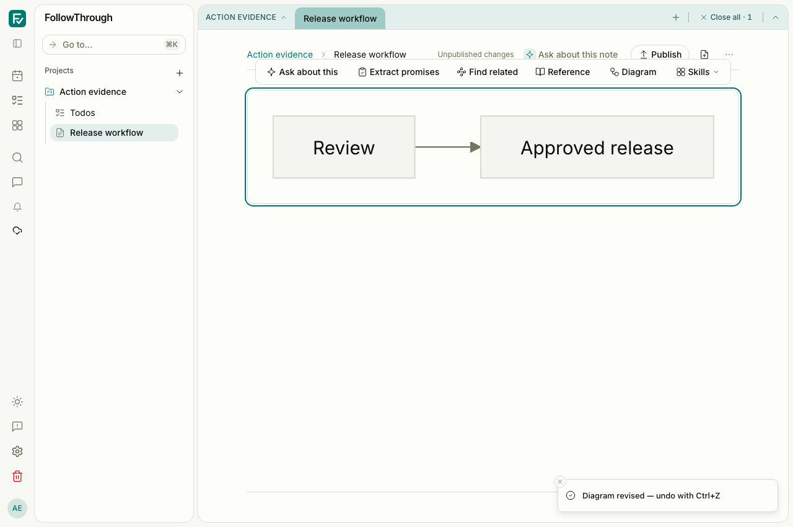

# Browser note actions and immediate diagram review

The before captures use #355 at `5f491f0d` in an isolated detached worktree. The after captures use this change. Both use Chromium, a light theme, the same synthetic note content, and a 1280 × 850 viewport. The narrow pair uses 390 × 844. These images verify preserved UI states; the concurrency fixes are verified by behavior tests.

## Reproduction

The scenarios create a unique user, session, inbox project and note in local Postgres. They use a session cookie with authentication enabled. Each scenario deletes only its own user and cascading scenario records after verification. No private account data appears in the captures.

`tests/e2e/note-action-submission.e2e.ts` preserves the seed and interaction steps. Run it through the normal authenticated Playwright configuration, or a dedicated server/configuration using the same environment. The verification run used port 5197; the before server used port 5196.

1. Open the synthetic “Release workflow” note and select its paragraph. Abort only the `extractPromises` or `generateDiagram` remote POST. Observe the error toast. Verify the account-scoped pending request exists before sending, survives the failure and reload, and is reused on retry.
2. Seed a valid proposed draw.io conversion, its agent provenance and a Mermaid node carrying the pending suggestion ID. Open Review in the real editor. Abort only the `acceptSuggestion` remote POST. Observe the explicit failure, retry control and retained diagram. Close the dialog and dismiss the conversion. Observe the original Mermaid diagram remains and the suggestion status becomes `rejected` in Postgres.

The draw.io iframe is the real diagrams.net editor. Selection, generation and acceptance transport failures are deliberate browser network substitutions. Successful dismissal uses the real application and database. No live model execution was used. Successful acceptance, revision and conversion outcomes and session/concurrency races use typed controller transport fakes; these captures do not establish full model-to-result E2E coverage. Server acceptance also invokes embeddings, so a successful live acceptance was not attempted.

## Captures

| Before                                                                                               | After                                                                                              | Caption                                                                              |
| ---------------------------------------------------------------------------------------------------- | -------------------------------------------------------------------------------------------------- | ------------------------------------------------------------------------------------ |
|                 |                 | Selected note text remains available after Extract promises fails.                   |
|                 |                 | Diagram generation keeps the source selection and reports the failure.               |
|                            |                            | The same error and note remain visible at 390 px.                                    |
|  |  | Failed acceptance keeps the dialog open with an explicit error and retry control.    |
|                |                | Dismissal removes the pending conversion and preserves the original Mermaid diagram. |

## Observed validation and limits

All eleven authenticated E2E scenarios passed together in 44.3 seconds: five note-action cases, four note-workspace cases and two note-editor-operation cases. The same eleven scenarios passed on the action-run baseline in 38.7 seconds. After the final storage-ordering change, all five note-action scenarios passed again in 23.6 seconds on the HMR-disabled server. Targeted ESLint passed. Screenshots were inspected for the stated states. The final dedicated development server disabled HMR so concurrent type-check generation could not reload the browser during autosave. With HMR enabled, two broad runs hit the existing clipboard/autosave poll timeout during development-server reloads; the isolated case passed on both revisions, and the complete stable-server rerun passed without assertion changes.

The final isolated before and after captures produced no browser page errors. Both development servers logged a missing `/offline-shell.html` request; service-worker installation and offline-shell availability are not established by these captures. The existing offline-save and conflict E2E scenarios passed separately.

## Action-run hydration and cancellation

The action-run before captures use `1ff7a20c`, the initial #357 implementation before action-run ownership moved into `NoteWorkspace`. The action-run after captures use the completed controller-independence change. Both use Chromium at 1280 × 850 in the light theme.

The hydration test seeds a completed diagram revision run, its prepared context and provenance, a saved `workflow_result` event and a terminal event in local Postgres. It stores the pending run under the existing account-scoped sessionStorage key. The test temporarily holds the real SSE request to capture the mounted original Mermaid diagram, then releases it. The application replays the saved event, replaces the diagram source, saves the note through normal autosave and removes the acknowledged pending run. The model is not executed and the event payload is not substituted at the network boundary.

The cancellation test seeds a queued selection run and its durable queue event after server startup. It hydrates the pending run, opens the selection controls and clicks Cancel. The real cancellation endpoint and event stream deliver a cancelled result, and the browser removes the pending record. No worker is started for the seeded run.

| Before                                                                                                 | After                                                                                                | Caption                                                                          |
| ------------------------------------------------------------------------------------------------------ | ---------------------------------------------------------------------------------------------------- | -------------------------------------------------------------------------------- |
|    |    | The saved pending run hydrates while its original diagram remains visible.       |
|  |  | Saved event replay updates the mounted diagram and autosaves its revised source. |
