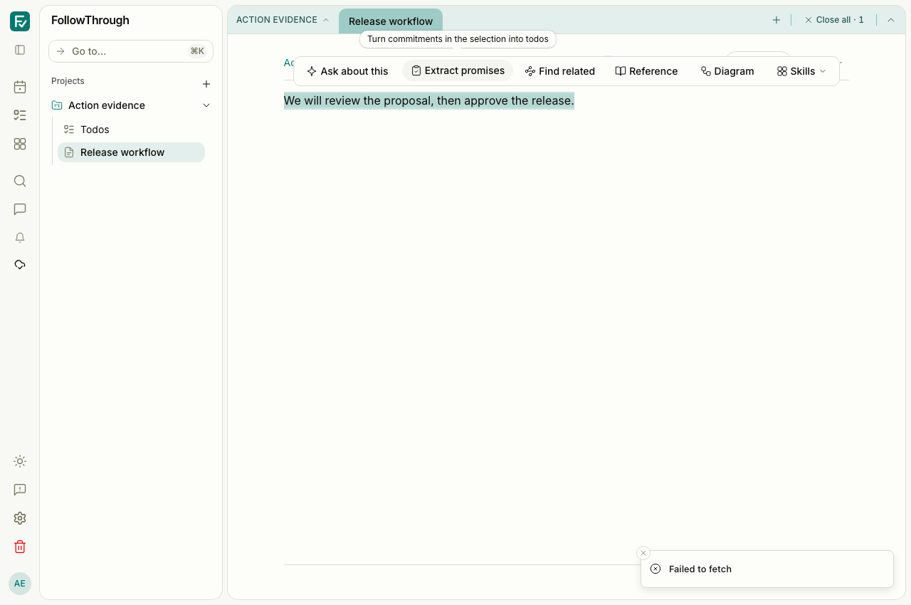
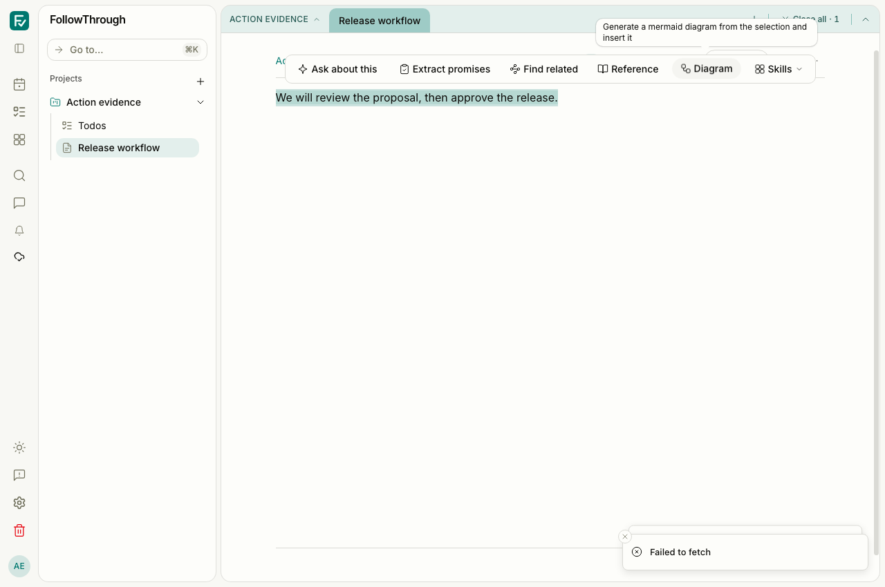
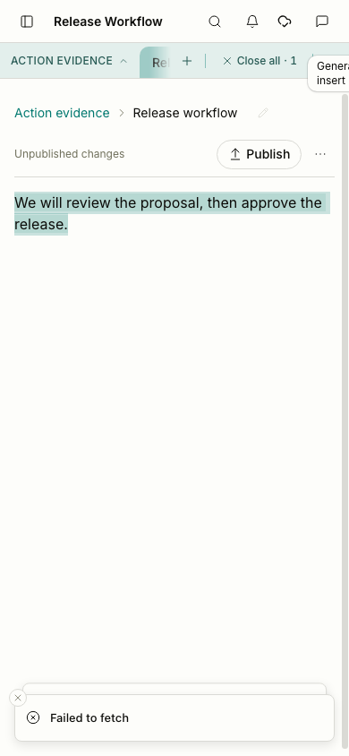
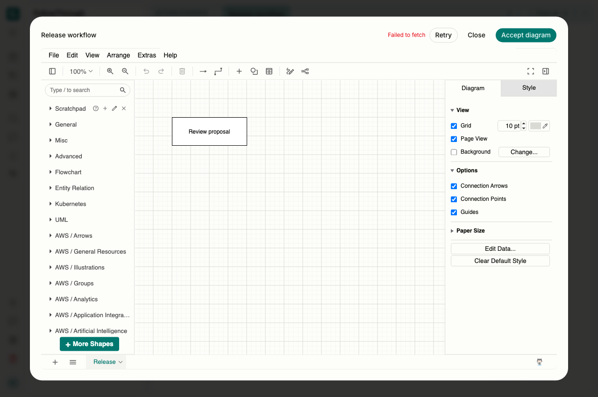
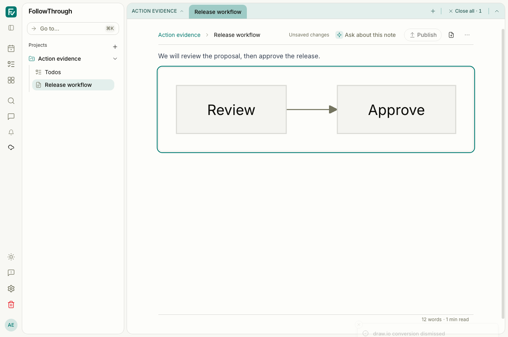
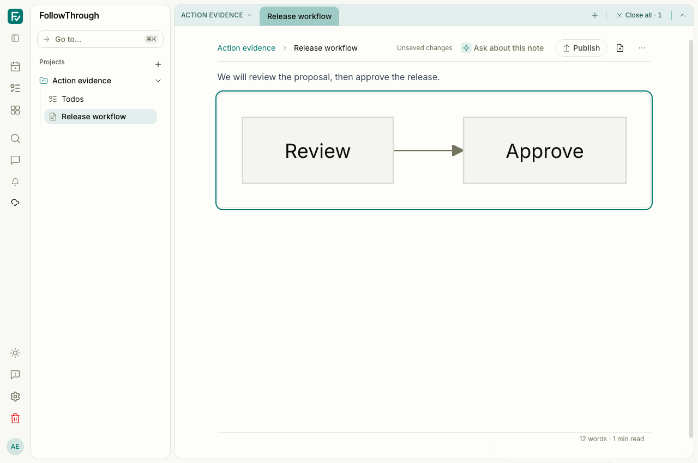

# Browser note actions and immediate diagram review

The before captures use #355 at `5f491f0d` in an isolated detached worktree. The after captures use this change. Both use Chromium, a light theme, the same synthetic note content, and a 1280 × 850 viewport. The narrow pair uses 390 × 844. These images verify preserved UI states; the concurrency fixes are verified by behavior tests.

## Reproduction

The scenarios create a unique user, session, inbox project and note in local Postgres. They use a session cookie with authentication enabled. Each scenario deletes only its own user and cascading scenario records after verification. No private account data appears in the captures.

`tests/e2e/note-action-submission.e2e.ts` preserves the seed and interaction steps. Run it through the normal authenticated Playwright configuration, or a dedicated server/configuration using the same environment. The verification run used port 5197; the before server used port 5196.

1. Open the synthetic “Release workflow” note and select its paragraph. Abort only the `extractPromises` or `generateDiagram` remote POST. Observe the error toast. Verify the account-scoped pending request exists before sending, survives the failure and reload, and is reused on retry.
2. Seed a valid proposed draw.io conversion, its agent provenance and a Mermaid node carrying the pending suggestion ID. Open Review in the real editor. Abort only the `acceptSuggestion` remote POST. Observe the explicit failure, retry control and retained diagram. Close the dialog and dismiss the conversion. Observe the original Mermaid diagram remains and the suggestion status becomes `rejected` in Postgres.

The draw.io iframe is the real diagrams.net editor. Selection, generation and acceptance transport failures are deliberate browser network substitutions. Successful dismissal uses the real application and database. No live model execution was used. Successful acceptance, revision and conversion outcomes and session/concurrency races use typed controller transport fakes; these captures do not establish full model-to-result E2E coverage. Server acceptance also invokes embeddings, so a successful live acceptance was not attempted.

## Captures

| Before                                                                                               | After                                                                                              | Caption                                                                              |
| ---------------------------------------------------------------------------------------------------- | -------------------------------------------------------------------------------------------------- | ------------------------------------------------------------------------------------ |
|                 |                 | Selected note text remains available after Extract promises fails.                   |
|                 |                 | Diagram generation keeps the source selection and reports the failure.               |
|                            |                            | The same error and note remain visible at 390 px.                                    |
|  |  | Failed acceptance keeps the dialog open with an explicit error and retry control.    |
|                |                | Dismissal removes the pending conversion and preserves the original Mermaid diagram. |

## Observed validation and limits

All nine unique authenticated E2E scenarios passed: three note-action cases, four note-workspace cases and two note-editor-operation cases. The initial eight-case run passed in 26.5 seconds. The three-case action file, including immediate acceptance failure and dismissal, passed in 7.9 seconds. Targeted ESLint passed. Screenshots were inspected for the stated states.

The final isolated before and after captures produced no browser page errors. Both development servers logged a missing `/offline-shell.html` request; service-worker installation and offline-shell availability are not established by these captures. The existing offline-save and conflict E2E scenarios passed separately.
