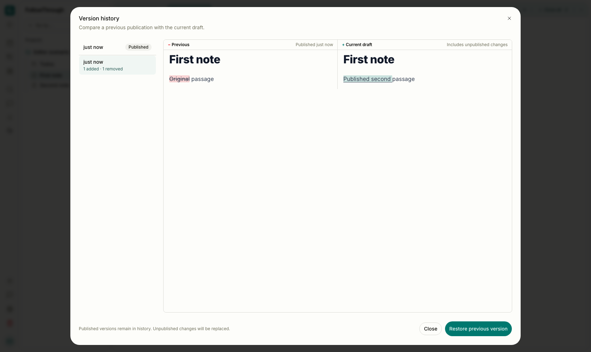
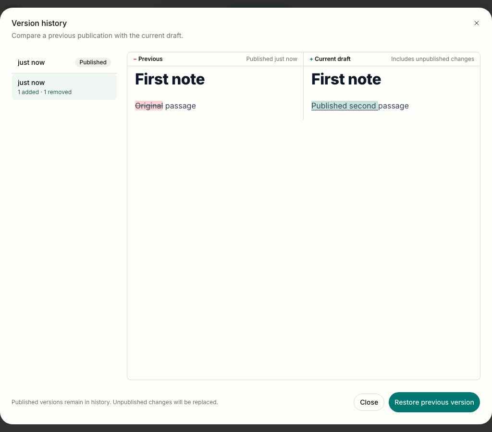

# Browser note history evidence

Before captures use #352 at `55383a596787bde5ddb42b90b5f7e9378158e5f6`.
After captures use the independent history controller. Both show the real authenticated app
in light mode at 1680 × 1000 and 1024 × 900, with equivalent synthetic note data.
The dialog has been closed, reopened, and switched from its preferred published snapshot to
an older revision. Comparison rules and layout are unchanged.



Before — the older publication is selected after reopening, ready for restoration.


After — the same older publication and current draft remain available for restoration.


Before — the older publication is selected in the narrow dialog.



After — the same comparison and restore flow remain available at narrow width.

## Reproduction

Use a local development/test PostgreSQL database. The existing Playwright fixtures create
synthetic accounts, sessions, projects, preferences and notes and remove their own accounts
in teardown. They authenticate with the normal session cookie. No live model or external
object-storage calls are needed.

```sh
pnpm test:e2e tests/e2e/note-workspace.e2e.ts tests/e2e/note-editor-operations.e2e.ts
```

Publish the original passage, publish a second passage, then save and discard an unpublished
draft. Open Version history, select the older revision, close the dialog and reopen it.
Select the older revision again. Capture the comparison before confirming restoration.
Restore, switch to the sibling tab, return and reload to verify persisted content.
The capture variant repeats the same journey at both viewports on dedicated port 5193.

Screenshots verify retained presentation and dialog reopening. Deferred-reader controller tests
separately verify late success/failure, cancellation, account replacement and pane isolation.
Browser tests observe the real passive session store across logout and same-account restart.
The unchanged restoration test verifies that historical replacement cancels pending clipboard input.

The final seven-journey run passed. An earlier run timed out waiting for autosave before
opening history. Three repeats against unchanged #352 passed; the timeout's cause remains
unclassified. No autosave code or assertions changed. Final captures wait for all toasts to
disappear and disable animations so the restore controls remain visible.

Development output retains `/offline-shell.html` 404s and Svelte `derived_inert` warnings.
This verification does not cover production PWA installation or live AI/object-storage flows.
