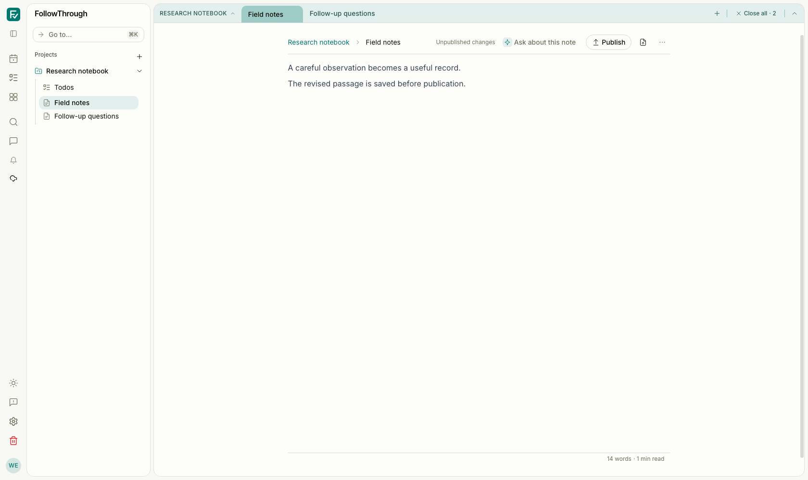
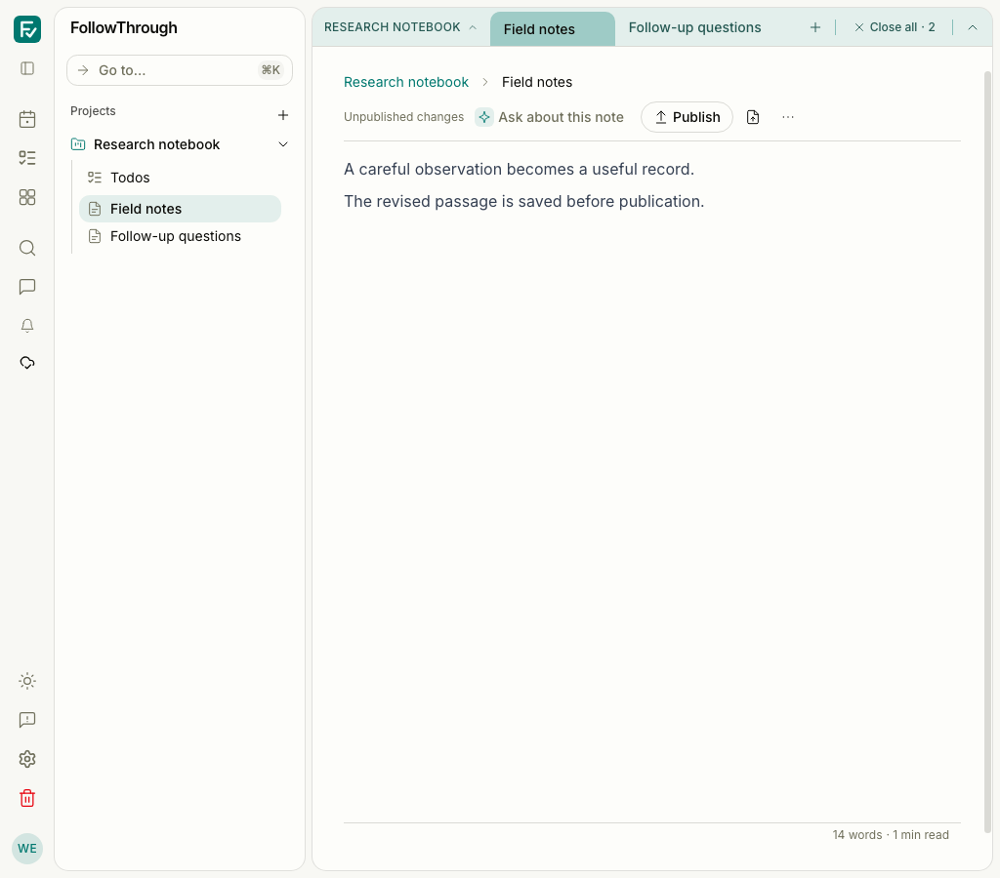
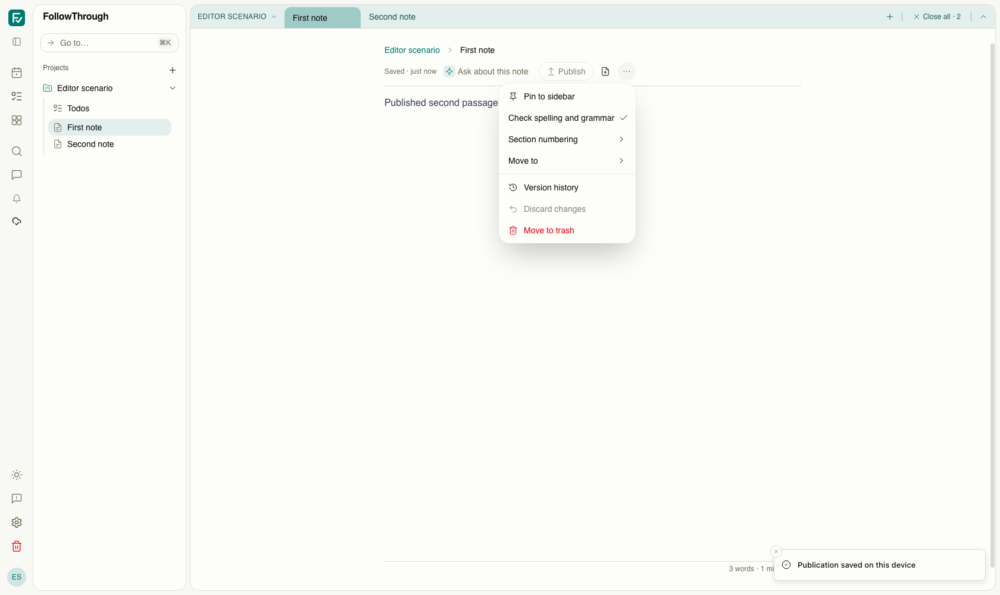
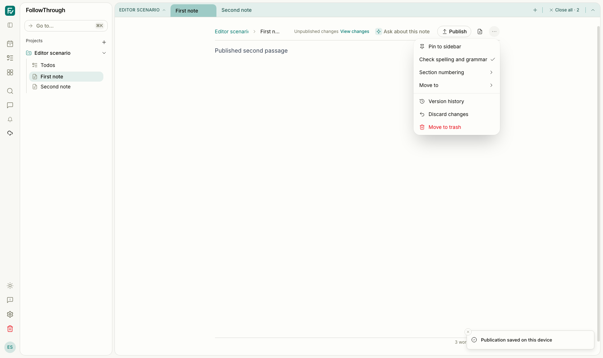

# Note workspace browser evidence

The captures use synthetic local accounts and real authenticated browser sessions. Each scenario
creates its own account, project, and two notes in the local development database, then removes
only that account and its records. No live AI action is part of these scenarios.

## Saved note layout

Before images were captured from #349 (`7cd5b2a8`) before editing the component. After images use
the refactored controller. Both use light mode, the same synthetic content, sibling tabs, and a
saved unpublished edit. Viewports are 1680 × 1000 and 1024 × 900. The note body, publication
control, and sibling tab remain visible.


Before — the desktop note shows the saved passage, unpublished status, and Publish control.



After — the controller preserves the desktop editor layout and saved content.



Before — at 1024 px, the header wraps while the publication control stays visible.


After — the same narrow state preserves the note body, tabs, and publication control.

## Publication acknowledgement

An isolated checkout of #349 reproduced an existing failure: publish the original note, then
edit and let autosave commit another passage. The database contains the new body, but Publish
and Discard changes remain disabled. The fixed run uses the same seed, viewport, theme, and
open Note actions menu. The controller now reconciles acknowledged revision metadata while
retaining the editor document.



Before — the saved second passage cannot be published or discarded from the mounted editor.



After — the saved second passage is marked unpublished; Publish and Discard changes are enabled.

## Verification

Five browser journeys passed against the isolated development server on port 5187:

- Existing editor operations: remembered selection, clipboard paste, undo/redo, autosave,
  sibling tabs, reload, and note-to-chat handoff.
- Publication, another autosave and publication, draft discard, historical restore, and sibling
  navigation followed by reload. Database reads confirm each resulting note body.
- Offline manual save retains the selection. Publication and undo/redo work before reconnect;
  the saved body survives reconnect and reload.
- A separate browser context writes a conflicting version. Keep mine preserves the local body
  through persistence and reload.
- The same conflict setup with Use latest adopts the remote body through persistence and reload.

The new cases are in `tests/e2e/note-workspace.e2e.ts`; the existing editor case is in
`tests/e2e/note-editor-operations.e2e.ts`. Run them against the standard authenticated development
setup with:

```sh
pnpm test:e2e tests/e2e/note-workspace.e2e.ts tests/e2e/note-editor-operations.e2e.ts
```

The observed run used an ignored Playwright configuration to select the isolated server, one
worker, and the 1680 × 1000 viewport. All five tests passed in 18.9 seconds. New fixtures disable
inline suggestions. The server used dummy model credentials; these checks do not validate AI
providers or object storage.
