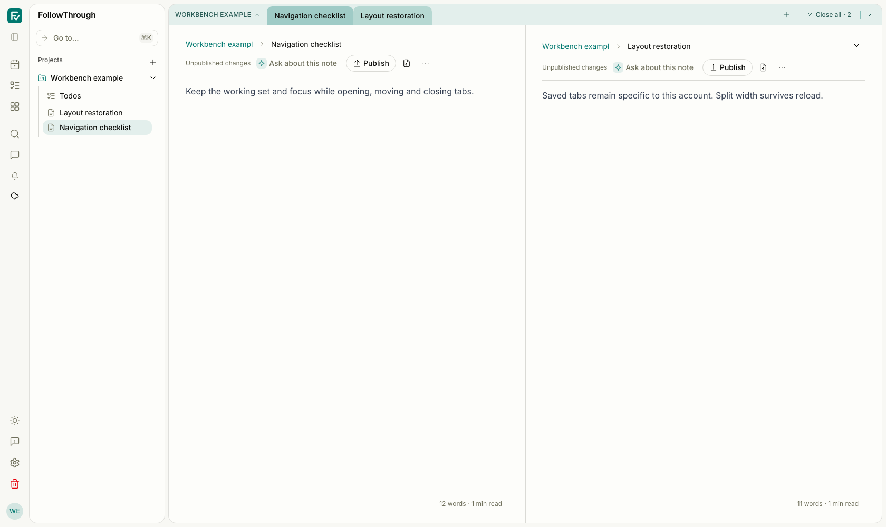
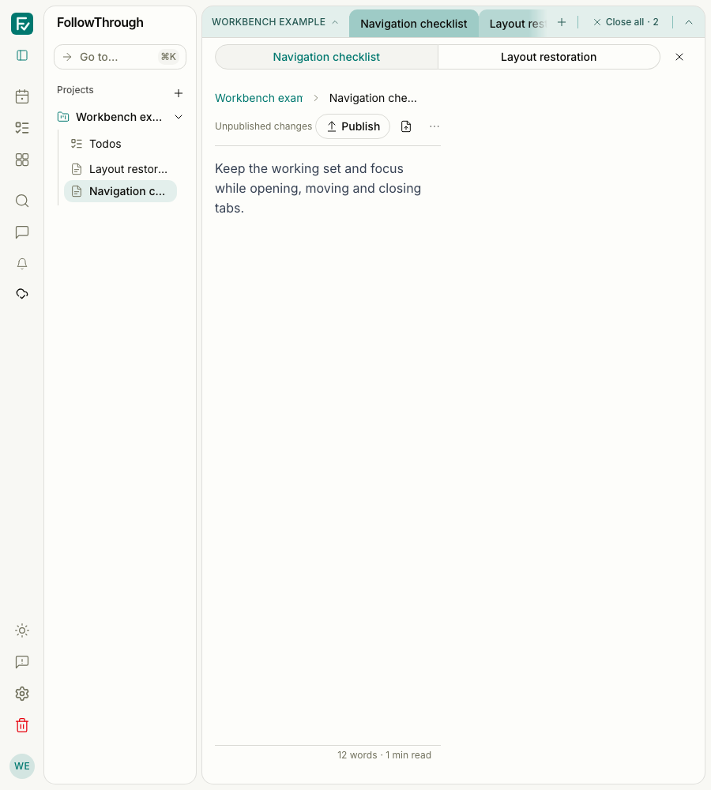

# Workbench controller refactor evidence

The before captures use #338 at `dc4bd7a2`. The after captures use this contribution.
Both show the running authenticated app with the same synthetic account, data, light theme,
reduced motion and split URL. No model calls were made. This refactor preserves the rendered layout.

## Reproduction

Use the authenticated local setup in `AGENTS.md` and a dedicated browser context. For these
captures, a local-only fixture created a `USER` account, a session, an inbox project named
“Workbench example”, and two unpublished notes with ordinary paragraph documents:

- “Navigation checklist”: “Keep the working set and focus while opening, moving and closing tabs.”
- “Layout restoration”: “Saved tabs remain specific to this account. Split width survives reload.”

Open `/notes/<first>?tabs=<first>,<second>&split=<second>`. Wait for both note panes, the editor
and fonts. Use a fresh context for each before/after run, a 50% split, light theme and reduced
motion. Capture at 1,680×1,000, then resize to 900×1,000. Move the pointer away and blur focus
before capturing. Delete only the fixture account and its records after verification.

The implementation run kept its temporary driver and logs under ignored `artifacts/workbench/`.
The durable automated scenarios are `tests/e2e/workbench-tabs.e2e.ts`,
`tests/e2e/workbench-split.e2e.ts`, `tests/e2e/chat-handoff.e2e.ts` and
`tests/e2e/workbench-account.e2e.ts`. The account test uses the isolated PWA harness:
`pnpm test:sync:pwa tests/e2e/workbench-account.e2e.ts`.

## Captures

Before — at 1,680 px, both note panes and their tabs are visible.

After — at 1,680 px, the same split layout remains visible with controller-owned operations.

Before — at 900 px, the split uses a pane switcher and shows the first note.

After — at 900 px, the pane switcher and first-note view remain unchanged.
