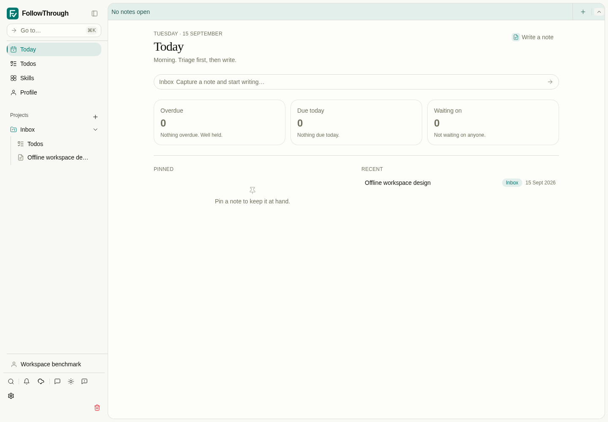
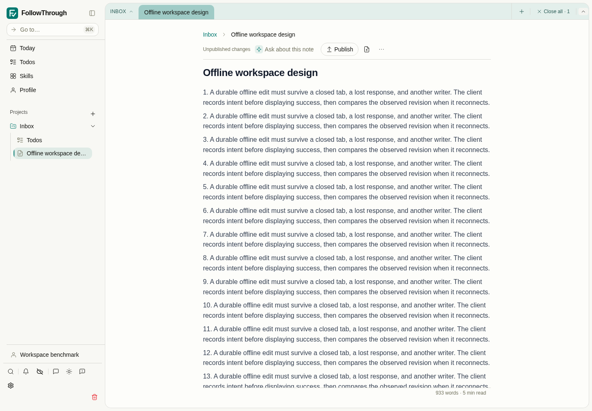
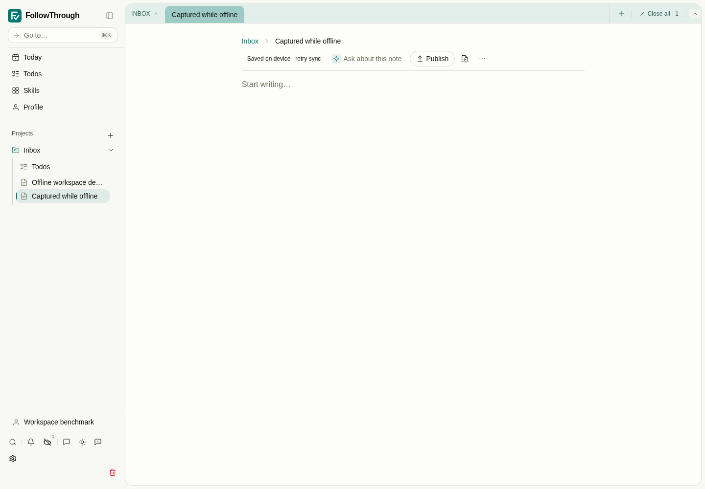
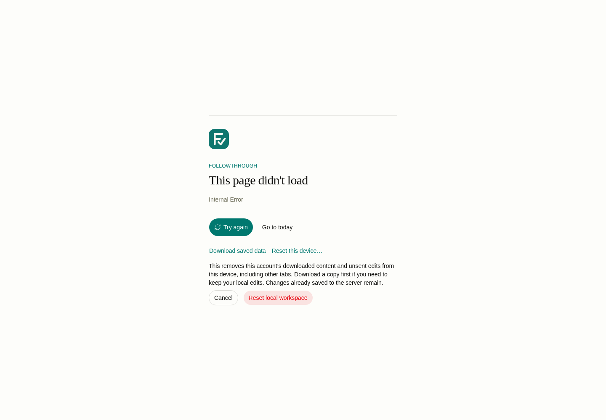
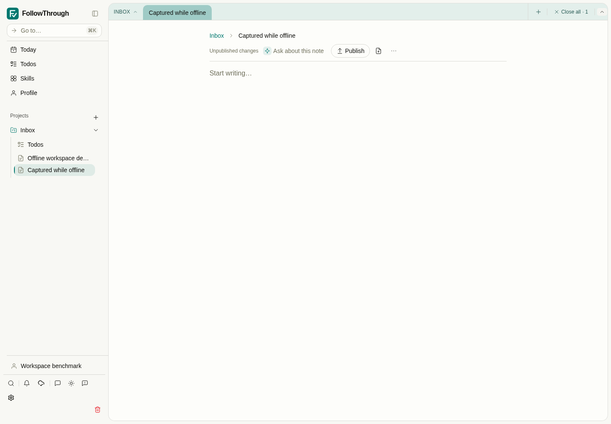

# Workspace sync simplification evidence

The benchmark runs the production PWA against disposable PostgreSQL 17 with pgvector.
It seeds one account, Inbox, note and conversation, 5,000 rich text messages and 2,000
provenance records. Each message contains 2,160 UTF-8 bytes of Markdown paragraphs,
code, a list and a table. The note document contains 7,858 bytes. No LLM call is made.
Authentication uses a directly minted local session, as in the PWA test setup.

## Method

Use Node 22 on PATH and install the worktree's dependencies. From the implementation
worktree, run:

```bash
node docs/pr-evidence/workspace-sync-simplification/benchmark.mjs WORKTREE after OUTPUT_DIRECTORY
```

The script builds that worktree, starts preview on port 4184, and runs Chromium at
1440 × 1000 in light mode. It removes its PostgreSQL container and closes the browser
and server on completion or failure. `METRICS_ONLY=1` omits the later capture/reset
scenarios. `SKIP_BENCHMARK_BUILD=1` reuses a build made from the same source.

For the baseline, use a separate worktree at `98194989d91f59d14db24845267734a4f1baf2fc`,
apply `baseline-prerequisite.patch`, and pass `before` instead of `after` (port 4183).
The patch only normalizes PostgreSQL provenance timestamps. Without it, valid provenance
cannot pass the original parser, preventing a useful comparison of the sync mechanisms.
The final implementation includes that fix and a PostgreSQL regression test.

Timing starts before navigation to Today. First usable means its heading is visible;
full synchronization means the sync control reports everything saved. The script then
counts stored bodies, opens the note, goes offline, reloads and waits for an editable
note body. RPC counts and decoded response bytes cover cold startup through full sync.
Long tasks come from Chromium's PerformanceObserver over that same interval.

These are exploratory single runs on a shared development machine, not statistical
latency estimates. Some diagnostic runs overlapped other checks. No speedup ratio is
claimed against the incomplete baseline. Decoded RPC bytes exclude assets and HTTP
compression. The benchmark does not establish mobile performance or browser quota limits.

## Observed results

The baseline did not render Today within five minutes. It had transferred 1,401,402 RPC
bytes in 59 responses. Its 117 long tasks occupied 278,756 ms, with a maximum of 3,681 ms.
Those transfer counts describe partial progress, not a cheaper completed download.

The first successful simplified run still used JSON identity filters and took 123.8 seconds.
PostgreSQL EXPLAIN showed a full scan of 5,000 messages for each identity lookup. Direct
primary-key comparison changed the sampled lookup from 6.221 ms and 477 shared buffer hits
to 0.190 ms and 5 hits. See `indexed-lookup.txt`; this is a query sample, not an app latency ratio.

With indexed lookups and 32-record pages, all 7,004 bodies downloaded in 73.8 seconds.
Cold startup used 220 RPCs and 14,540,628 decoded bytes. Cached offline editor opening took
1.56 seconds. The run recorded 175 long tasks totaling 14,024 ms (maximum 150 ms).
See `32-record-pages.json`. That measurement motivated larger complete pages to reduce
request, transaction and full-projection costs.

With 128-record pages, all 7,004 bodies downloaded in **31.3 seconds**, using **56 RPCs**
and **14,534,922 decoded bytes**. Cached offline editor opening took **1.69 seconds**.
Chromium recorded **46 long tasks totaling 3,966 ms**, with a maximum of 164 ms.
The page-size change reduced measured cold-start time and total long-task work while
leaving transferred content and offline-open time essentially unchanged. See `after-metrics.json`.

## UI scenarios

The same full-app run creates a note through Today while offline, reconnects and waits
for its server acknowledgement. It then deliberately damages one local record, reloads,
downloads the raw database and checks that the damaged content remains in the export.
It captures the reset confirmation, confirms reset and verifies that the server note
reopens after downloading the account again. This is seeded production PWA verification,
without a live model call.

The starting-state capture is the actual blank baseline after its five-minute timeout.
The reset captures show the new flow, not a fabricated before state for the old repair UI.

## Code and mechanism footprint

Both source counts compare against the same master commit. The exact classification,
revisions and raw added/deleted counts are in `code-footprint.json`. Test and fake code
is separate from application code. Gross additions remain substantial.

| Measure                 | Baseline | Simplified |
| ----------------------- | -------: | ---------: |
| Net application lines   |    7,432 |      6,224 |
| Added application lines |   12,392 |     11,323 |
| Net test/fake lines     |    9,004 |      7,855 |
| Account stores          |        9 |          4 |
| Runtime lanes           |        3 |          2 |
| IndexedDbOutbox lines   |      449 |        229 |

This removes 1,208 net application lines (16.3%). The larger architectural change is
removal of entire durability and scheduling mechanisms. It does not make the whole
feature small, and it is not a 50% reduction in total application code.


Before — the large-workspace baseline still shows a blank page after five minutes.



After — Today renders after all 7,004 bodies are stored. The fixture and viewport match the baseline.



After — the downloaded note opens with an editable body while the browser is offline.



Offline capture — the note exists locally and reports that it is saved on this device.



Recovery — the raw export retains the damaged row. Reset explains that local unsent edits will be removed.



Recovery result — after confirmation, the account downloads again and the previously synchronized note reopens.
